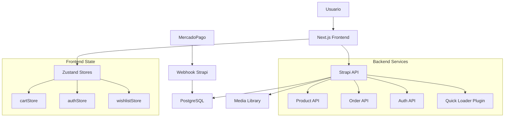

# Rano Urban - Tienda de Ropa Urbana

[](https://nextjs.org/)
[](https://reactjs.org/)
[](https://www.typescriptlang.org/)
[](https://tailwindcss.com/)
[](https://strapi.io/)

Una tienda de ropa urbana moderna y completa construida con Next.js 16, React 19 y Strapi como CMS headless.

## 🛍️ Características Principales

### Frontend (Next.js 16)
- **Diseño Moderno**: Sistema de diseño basado en Tailwind CSS v4 + shadcn/ui
- **E-commerce Completo**: Catálogo de productos, carrito de compras, checkout y wishlist
- **Búsqueda Avanzada**: Autocompletado con búsqueda por múltiples palabras
- **Filtros y Ordenamiento**: Por categoría, precio, nombre y novedades
- **Autenticación**: Login tradicional y Google OAuth
- **Perfil de Usuario**: Gestión de pedidos y datos personales
- **Checkout 2 Pasos**: Flujo optimizado con MercadoPago
- **Responsive Design**: Experiencia móvil-first
- **SEO Optimizado**: Metadatos completos, sitemap y robots.txt

### Backend (Strapi)
- **CMS Headless**: Gestión completa de productos y categorías
- **Plugin Quick Loader**: Administración rápida de productos
- **Sistema de Pedidos**: Gestión integral de órdenes
- **Configuración de Tienda**: Horarios, envíos, redes sociales
- **MercadoPago Integration**: Webhooks para procesamiento de pagos
- **Multi-idioma**: Soporte para español e inglés
- **Media Management**: Upload optimizado de imágenes

## 🚀 Arquitectura

### Estructura del Proyecto

```
rano-app/
├── frontend/                    # Next.js 16 + React 19
│   ├── src/
│   │   ├── app/               # App Router (Next.js 16)
│   │   │   ├── (shop)/       # Layout de tienda
│   │   │   ├── api/          # Rutas API del frontend
│   │   │   └── globals.css   # Estilos globales
│   │   ├── components/       # Componentes UI
│   │   │   ├── ui/          # shadcn/ui base components
│   │   │   ├── products/    # Componentes de productos
│   │   │   ├── search/      # Sistema de búsqueda
│   │   │   ├── wishlist/    # Sistema de favoritos
│   │   │   └── providers/   # Context providers
│   │   ├── lib/             # Utilidades y API
│   │   │   ├── api/         # Cliente Strapi
│   │   │   └── utils.ts     # Funciones helper
│   │   ├── store/           # Zustand state management
│   │   │   ├── cartStore.ts     # Carrito de compras
│   │   │   ├── authStore.ts     # Autenticación
│   │   │   └── wishlistStore.ts # Favoritos
│   │   ├── types/           # TypeScript definitions
│   │   └── constants/       # Configuración de tienda
│   ├── public/              # Assets estáticos
│   │   ├── webp/           # Imágenes optimizadas
│   │   └── avif/           # Imágenes AVIF
│   └── package.json        # Dependencias frontend
├── backend/                 # Strapi CMS Headless
│   ├── src/
│   │   ├── api/            # Content Types API
│   │   │   ├── product/    # Productos y custom routes
│   │   │   ├── category/   # Categorías
│   │   │   ├── order/      # Pedidos
│   │   │   ├── contact/    # Formulario contacto
│   │   │   ├── auth/       # Autenticación Google
│   │   │   └── webhook/    # MercadoPago webhooks
│   │   ├── plugins/        # Plugins personalizados
│   │   │   └── quick-loader/ # Admin plugin rápido
│   │   ├── middlewares/    # Middleware personalizados
│   │   └── components/     # Componentes Strapi
│   ├── config/             # Configuración Strapi
│   │   ├── database.ts     # PostgreSQL
│   │   ├── plugins.ts      # Plugins activos
│   │   └── cron-tasks.ts   # Tareas programadas
│   ├── scripts/            # Scripts de utilidad
│   │   └── seed.ts         # Datos iniciales
│   └── package.json        # Dependencias backend
├── nginx/                  # Nginx proxy reverso
│   └── nginx.conf         # Configuración de proxy
├── docs/                   # Documentación
│   ├── PERMISOS_STRAPI.md  # Guía de permisos
│   └── Tienda Rano API.postman_collection.json
├── .github/               # GitHub Actions
│   └── workflows/
│       └── deploy.yml     # CI/CD pipeline
├── docker-compose.yml     # Desarrollo
├── docker-compose.prod.yml # Producción
└── README.md             # Este archivo
```

### Flujo de Datos



### Arquitectura de Componentes

#### Frontend (Next.js 16)
- **App Router**: Estructura basada en layouts y route groups
- **Server Components**: Carga de datos en servidor para SEO
- **Client Components**: Interactividad con React 19
- **State Management**: Zustand con persistencia localStorage
- **UI System**: Tailwind CSS v4 + shadcn/ui + Radix UI

#### Backend (Strapi 5)
- **Content Types**: Productos, Categorías, Pedidos, Contacto
- **Custom Routes**: Endpoints personalizados para checkout
- **Plugins**: Quick Loader para administración rápida
- **Webhooks**: Integración con MercadoPago
- **Cron Tasks**: Limpieza de imágenes huérfanas

### Base de Datos

#### PostgreSQL Schema
```sql
-- Productos
products (id, name, slug, description, price, compare_price, 
          sku, stock, sizes, colors, tags, featured, category_id)

-- Categorías  
categories (id, name, slug, description, products)

-- Pedidos
orders (id, customer_info, items, total, status, payment_id, 
        created_at, updated_at)

-- Configuración Tienda
store_configs (id, address, phone, email, social_links, 
               shipping_info, schedules)
```

### Integraciones Externas

- **MercadoPago**: Procesamiento de pagos y webhooks
- **Google OAuth**: Autenticación de usuarios
- **Nodemailer**: Envío de emails transaccionales
- **GitHub Container Registry**: Almacenamiento de imágenes Docker

## 🛠️ Stack Tecnológico

### Frontend
- **Framework**: Next.js 16 (App Router)
- **UI Library**: React 19
- **Styling**: Tailwind CSS v4
- **Components**: shadcn/ui + Radix UI
- **State Management**: Zustand
- **HTTP Client**: Axios
- **Form Validation**: Zod
- **Icons**: Lucide React

### Backend
- **CMS**: Strapi (Headless)
- **Database**: PostgreSQL 17
- **File Upload**: Strapi Media Library
- **Authentication**: JWT + Google OAuth

### DevOps
- **Containerization**: Docker + Docker Compose
- **Web Server**: Nginx (proxy reverso)
- **Deployment**: GitHub Container Registry
- **CI/CD**: GitHub Actions

## 📦 Instalación y Desarrollo

### Prerrequisitos
- Node.js 20+
- Docker y Docker Compose
- PostgreSQL (si no usas Docker)

### Desarrollo Local

1. **Clonar el repositorio**
```bash
git clone <repository-url>
cd rano-app
```

2. **Configurar variables de entorno**
```bash
cp .env.example .env
# Editar .env con tus configuraciones
```

3. **Iniciar con Docker**
```bash
docker-compose -f docker-compose.dev.yml up -d
```

4. **Acceder a las aplicaciones**
- Frontend: http://localhost:4000
- Backend (Strapi): http://localhost:4001
- Base de datos: localhost:5434

### Desarrollo sin Docker

1. **Instalar dependencias**
```bash
# Frontend
cd frontend
npm install

# Backend (Strapi)
cd ../backend
npm install
```

2. **Configurar base de datos**
```bash
# Crear base de datos PostgreSQL
createdb tienda
```

3. **Iniciar aplicaciones**
```bash
# Terminal 1 - Frontend
cd frontend
npm run dev

# Terminal 2 - Backend
cd backend
npm run develop
```

## 🔧 Configuración

### Variables de Entorno

#### Frontend (.env)
```env
NEXT_PUBLIC_API_URL=http://localhost:4001
```

#### Backend (.env)
```env
DATABASE_CLIENT=postgres
DATABASE_HOST=localhost
DATABASE_PORT=5432
DATABASE_NAME=tienda
DATABASE_USERNAME=tienda_user
DATABASE_PASSWORD=tu_password

JWT_SECRET=tu_jwt_secret
GOOGLE_CLIENT_ID=tu_google_client_id
GOOGLE_CLIENT_SECRET=tu_google_client_secret

MERCADOPAGO_ACCESS_TOKEN=tu_mp_token
```

### Permisos de Strapi

Verifica la configuración de permisos en `docs/PERMISOS_STRAPI.md` para asegurar el funcionamiento correcto de la tienda.

## 📱 Funcionalidades Detalladas

### Catálogo de Productos
- Vista de cuadrícula (2/3 columnas)
- Detalles de producto con galería de imágenes
- Productos destacados en carousel
- Búsqueda por nombre con autocompletado
- Filtros por categoría, precio y etiquetas

### Carrito y Checkout
- Carrito persistente con localStorage
- Proceso de checkout en 2 pasos
- Integración con MercadoPago
- Página de confirmación de pedido
- Gestión de stock en tiempo real

### Usuario y Cuenta
- Registro y login tradicional
- Autenticación con Google OAuth
- Perfil de usuario editable
- Historial de pedidos
- Wishlist/favoritos

### Administración
- Plugin Quick Loader para gestión rápida
- Dashboard con estadísticas de ventas
- Gestión de productos y categorías
- Configuración de tienda (horarios, envíos)
- Limpieza automática de imágenes huérfanas

## 🚀 Producción

### Build y Deploy
```bash
# Build de imágenes Docker
docker-compose -f docker-compose.prod.yml build

# Deploy en producción
docker-compose -f docker-compose.prod.yml up -d
```

### GitHub Container Registry
El proyecto utiliza GHCR para almacenar imágenes Docker pre-construidas, optimizando los tiempos de deploy.

## 📊 Versiones y Changelog

Ver `CHANGELOG.md` para el historial completo de cambios y nuevas funcionalidades.

**Versión Actual**: 0.6.0 (Diciembre 2025)

## 🤝 Contribución

1. Fork del proyecto
2. Crear feature branch (`git checkout -b feature/nueva-funcionalidad`)
3. Commit de cambios (`git commit -m 'Add nueva funcionalidad'`)
4. Push al branch (`git push origin feature/nueva-funcionalidad`)
5. Pull Request

## 📄 Licencia

Este proyecto está bajo licencia MIT. Ver `LICENSE` para más detalles.

## 🆘 Soporte

Para problemas o preguntas:
- Revisa `docs/PERMISOS_STRAPI.md` para configuración de permisos
- Verifica los logs de Docker con `docker-compose logs`
- Revisa la configuración de variables de entorno

---

**Desarrollado con ❤️ para Rano Urban**

---

## 🔐 Lista de Permisos para Strapi

Para que la tienda funcione correctamente, debes habilitar los siguientes permisos en el panel de Strapi (**Settings** > **Users & Permissions Plugin** > **Roles**):

### 👥 Rol: Public
*Permisos para visitantes sin cuenta.*

- **Product**: `find`, `findOne`, `getFilters`
- **Category**: `find`, `findOne`
- **Store-config**: `find`
- **Order**: `checkout`
- **Contact**: `send`
- **Webhook**: `handleMercadoPago`
- **Auth**: `googleCallback`

### 🔑 Rol: Authenticated
*Permisos para usuarios logueados (además de los de Public).*

- **Product**: `find`, `findOne`, `getFilters`
- **Category**: `find`, `findOne`
- **Store-config**: `find`
- **Order**: `checkout`, `myOrders`
- **Contact**: `send`
- **Users-permissions** (User): `me`, `update`

> ⚠️ **Importante**: No habilites permisos de `create`, `update` o `delete` en productos o categorías para estos roles.